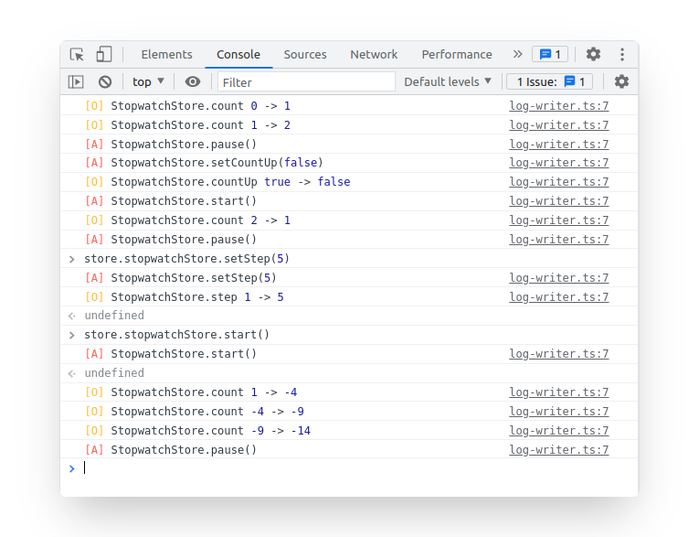

# mobx-log

[](https://badge.fury.io/js/mobx-log)
[](https://www.npmjs.com/package/mobx-log)
[](https://github.com/kubk/mobx-log/actions/workflows/main.yml)
[](https://github.com/prettier/prettier)

Logger for Mobx 6+. It logs Mobx actions, observables and computeds. It uses custom Chrome formatters, so you won't see awkward `[Proxy, Proxy]` in your console anymore. Supports `useLocalObservable` and stores created with a [factory function](https://github.com/kubk/mobx-log#usage-with-factory-functions). It also provides access to store in browser console, so you can log store, call actions and computeds. Works only in dev mode.

### Installation

```
npm i mobx-log
```

### Usage
1. Add `makeLoggable` to a store:

```diff
class SomeStore {
  ...

  constructor() {
    makeAutoObservable(this);
+   makeLoggable(this);
  }
}
```

2. In Chrome DevTools, press F1 to load the Settings. Scroll down to the Console section and check "Enable custom formatters":


### Customize

In order to customize `mobx-log` use `configureMakeLoggable` function.

---
**Recommended**: Access stores as global variables in browser console:
```js
import { configureMakeLoggable } from 'mobx-log';

configureMakeLoggable({
  storeConsoleAccess: true,
});
```

After it all the stores marked as loggable become accessible as global variables. Example:
```js
class AuthStore {
  constructor() {
    makeLoggable(this);
  }
}
```

Then you can type `store.authStore` in your browser console. Feel free to log store, call actions and computeds in the console. Works only in dev mode.

---
Enable debug mode  - log all Mobx spy reports. Useful for library contributors:
```js
import { configureMakeLoggable } from 'mobx-log';

configureMakeLoggable({
  debug: true
});
```
---
Log observables / computeds / actions conditionally:
```js
import { configureMakeLoggable } from 'mobx-log';

configureMakeLoggable({
  filters: {
    computeds: true,
    actions: true,
    observables: false,
  }
});
```
---
Customize logger output. Example - add time for each log entry:
```typescript

import { configureMakeLoggable, DefaultLogger, LogWriter } from 'mobx-log';

export const now = () => {
  const time = new Date();
  const h = time.getHours().toString().padStart(2, '0');
  const m = time.getMinutes().toString().padStart(2, '0');
  const s = time.getSeconds().toString().padStart(2, '0');
  const ms = time.getMilliseconds().toString().padStart(3, '0');

  return `${h}:${m}:${s}.${ms}`;
};

class MyLogWriter implements LogWriter {
  write(...messages: unknown[]) {
    console.log(now(), ...messages);
  }
}

configureMakeLoggable({
  logger: new DefaultLogger(new MyLogWriter()),
});
```

### Usage with factory functions
With Mobx 6 you can create stores without classes using makeAutoObservable / makeObservable:

```typescript 
export const createDoubler = () => {
  return makeAutoObservable({
    value: 0,
    get double() {
      return this.value * 2
    },
    increment() {
      this.value++
    }
  })
}
```

You can also log such stores using `makeLoggable`:

```typescript
export const createDoubler = () => {
  return makeLoggable(makeAutoObservable({
    loggableName: 'doubler', // <-- Required
    value: 0,
    get double() {
      return this.value * 2
    },
    increment() {
      this.value++
    }
  }))
}
```

The store also become available in console if you turn on `storeConsoleAccess` option.

### Usage with `useLocalObservable`

Before:
```typescript 
import { useLocalObservable } from 'mobx-react-lite'

...

const counterStore = useLocalObservable(() => {
  count: 0,
  increment: () => this.count++,
})
```

After:
```typescript 
import { useLoggableLocalObservable } from 'mobx-log'

...

const counterStore = useLoggableLocalObservable(() => {
  loggableName: 'counter', // <-- Required. You'll get TS type error if you forget about it
  count: 0,
  increment: () => this.count++,
})
```

The store also become available in console if you turn on `storeConsoleAccess` option.

### How it is different from alternatives?
- [mobx-logger](https://github.com/winterbe/mobx-logger) doesn't show [observables and computeds](https://github.com/winterbe/mobx-logger/issues/34) with Mobx 6 due to changes in Mobx internals.
- [mobx-remotedev](https://github.com/zalmoxisus/mobx-remotedev/issues) is [not maintained](https://github.com/zalmoxisus/mobx-remotedev/issues/55) anymore. It also doesn't show computeds.
- [mobx-devtools](https://github.com/mobxjs/mobx-devtools) does not show changes in computeds
- [mobx-react-devtools](https://github.com/mobxjs/mobx-react-devtools) is deprecated
- [mobx-formatters](https://github.com/motion/mobx-formatters) doesn't support Map & Set. Also it's just a proxy formatter, not a logger

### Example project
This library has example project located in `./example` folder. It is used for development purposes. To run it go to `./example` folder and run `npm run start`.

### Store destructuring
Prior to Mobx 6.3.4 bound actions didn't appear in the log. If you are using store destructuring and want your actions appear in the log please update your Mobx to 6.3.4. See the discussion for details: https://github.com/mobxjs/mobx/discussions/3140
